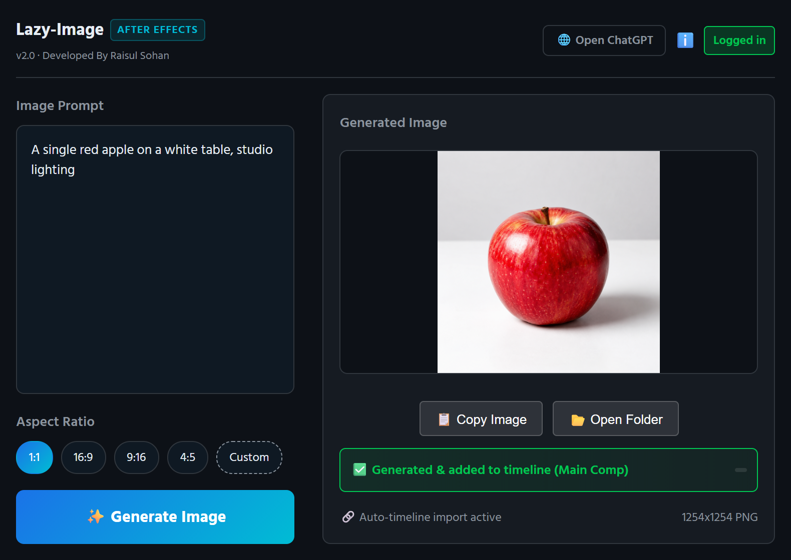

# Lazy-Image 🎨✨

> **Generate AI images with ChatGPT without ever leaving After Effects or Premiere Pro.**

Made by **[Raisul Sohan](https://raisulsohan.com)** · Version 2.3

  

---

## What it does

Type a prompt in the panel, press **Generate**, and a few seconds later the finished image is
sitting on your timeline — saved next to your project, filed into a folder in your project
panel, and placed at the playhead.

No browser window opens. No tab switching. No file hunting. No API keys.

**It uses your own ChatGPT account.** You sign in once, in a normal browser window, and after
that the browser is started invisibly only while an image is being made — then it closes again.
Nothing runs in the background, and it never steals keyboard focus from Adobe.

---

## Features

- 🎞️ **After Effects _and_ Premiere Pro** — one panel, the same features in both
- 🔑 **No API key, no extra billing** — works with your existing ChatGPT account (Free, Plus or Pro)
- 🙈 **Invisible** — no browser window, no taskbar button, nothing left running
- ⏱️ **Straight onto the timeline** — a layer at the playhead in After Effects, a clip on a free
  video track in Premiere Pro (it never overwrites your existing clips)
- 📂 **Tidy by itself** — images go into a `chatgptimages` folder next to your project and a
  `ChatGptImages` folder/bin inside it
- 📐 **Aspect ratios** — 1:1, 16:9, 9:16, 4:5, or anything custom
- 🌍 **Any language** — write prompts in English, বাংলা, हिन्दी, العربية, Español…
- 📊 **Live progress** and a **Cancel** button
- 💬 **Clear errors** — if ChatGPT hits a limit or declines a prompt, the panel tells you straight
  away in ChatGPT's own words instead of leaving you waiting
- 🔍 **Test button** — checks your setup in a few seconds without using up an image

---

## Requirements

- Windows 10 or 11
- After Effects and/or Premiere Pro, CC 2019 or newer
- Google Chrome or Microsoft Edge
- A ChatGPT account

---

## How to get it

Lazy-Image is a **paid product** and its source code is not public.

Each copy is licensed to one buyer and activated on their computer.

**📧 Email [lettertosohan@gmail.com](mailto:lettertosohan@gmail.com)** for pricing and a copy.

Installation takes about a minute: unzip, run the installer, paste the activation key you're
sent, and log in to ChatGPT once.

---

## Author

**Raisul Sohan**

- Website: [raisulsohan.com](https://raisulsohan.com)
- GitHub: [@raisulsohan](https://github.com/raisulsohan)
- Email: [lettertosohan@gmail.com](mailto:lettertosohan@gmail.com)

---

© Raisul Sohan. All rights reserved. Not open source.
